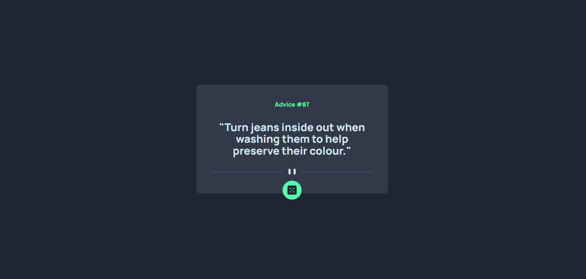
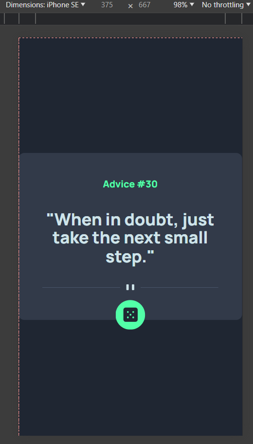

# Frontend Mentor - Advice generator app solution

This is a solution to the [Advice generator app challenge on Frontend Mentor](https://www.frontendmentor.io/challenges/advice-generator-app-QdUG-13db). Frontend Mentor challenges help you improve your coding skills by building realistic projects.

## Table of contents

- [Overview](#overview)
  - [The challenge](#the-challenge)
  - [Screenshot](#screenshot)
  - [Links](#links)
- [My process](#my-process)
  - [Built with](#built-with)
  - [What I learned](#what-i-learned)
  - [Continued development](#continued-development)
  - [Useful resources](#useful-resources)
- [Author](#author)

### The challenge

Users should be able to:

- View the optimal layout for the app depending on their device's screen size
- See hover states for all interactive elements on the page
- Generate a new piece of advice by clicking the dice icon

### Screenshot




### Links

- Solution URL: (https://github.com/hassanmoaa/Advice-Generator-App-FrontEndMentor.git)
- Live Site URL: (https://silly-cactus-ffea06.netlify.app)

### Built with

[](https://skillicons.dev)

### What I learned

I Completed a complex JS-API pattern for the first time which wasn't too hard went smoothly and i learned about using **Async & Fetch**!

This project helped me understand how to use FETCH-API and work with promises in JavaScript.

```
async function fetchRandomAdvice() {
	const response = await fetch('https://api.adviceslip.com/advice');
	const data = await response.json();
	console.log(data);
	id.innerHTML = `${data.slip.id}`;
	quote.innerHTML = `"${data.slip.advice}"`;
}

// Function to update the advice
function updateAdvice() {
	fetchRandomAdvice().then((advice) => {
		if (advice) {
			id.innerHTML = `${data.slip.id}`;
			quote.innerHTML = `"${data.slip.advice}"`;
		}
	});
}

```

### Continued development

- Full Stack Development

### Useful resources

- (https://developer.mozilla.org/)
- (https://www.w3schools.com)

## Author

- Frontend Mentor - [@hassanmoaa](https://www.frontendmentor.io/profile/hassanmoaa)
